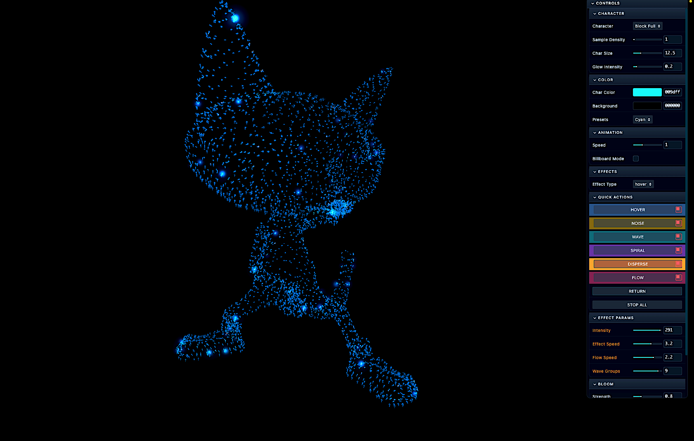
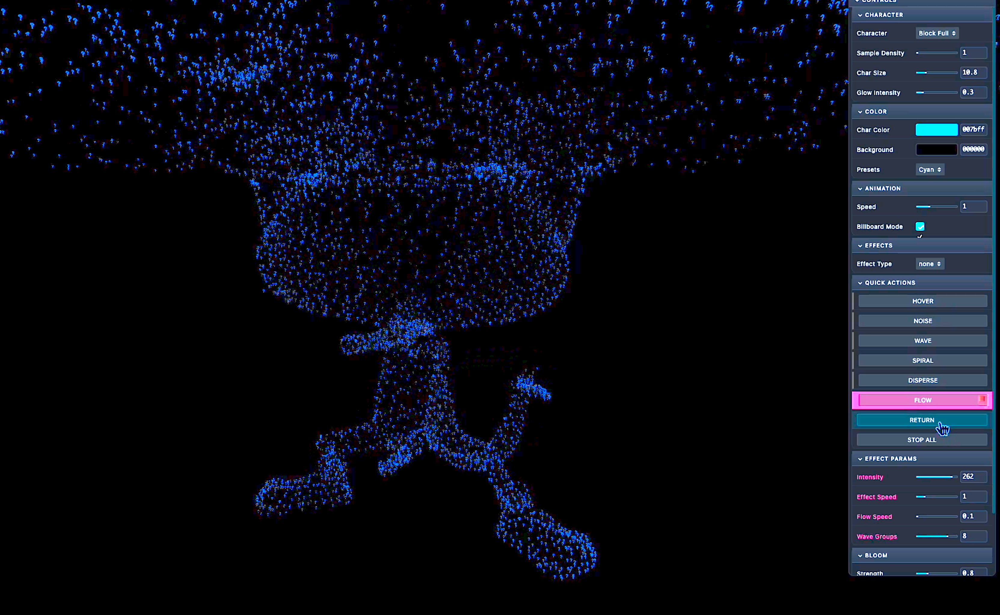

# NUCAT ✦

> _When your character wants to be a point cloud, you let them._


---

## The Vibe

<p align="center">
  
  
</p>
<p align="center">
  
  
</p>

<p align="center">
  <sub>From form → flow → entropy → ❓</sub>
</p>

---

## What Is This?

NUCAT is a **real-time ASCII point cloud renderer** that takes a rigged 3D character and explodes it into ~20,000 floating particles that dance, spiral, disperse, and flow—all while maintaining the skeleton animation underneath.

Think of it as your character having an out-of-body experience. But make it aesthetic.

**[Live Demo →](#)** _(coming soon)_

---

## ♿ Accessibility

- **Keyboard Navigation** — All GUI controls accessible via Tab/Enter
- **Screen Reader Support** — ARIA labels on interactive elements
- **Reduced Motion** — Respects `prefers-reduced-motion` (effects start paused)
- **High Contrast** — UI designed for visibility against dark backgrounds
- **No Flashing** — Effects are smooth, no rapid strobing

---

## ✦ Features

### 🎭 Multiple Characters
Switch between different cat models on the fly:
- **Slow Qi** — Meditative tai chi cat
- **Green Smoke** — Ethereal smoke cat  
- **Cat Fight** — Action-packed fighting cat

### 🔮 Incubation Chamber
Put your cat in a holographic display cube:
- **Holographic Mode** — Multi-layered iridescent glass cube
- **Rubix Mode** — 13×13 animated panel grid per face
- **Trackball Rotation** — Drag to spin, auto-rotates when idle

### 🌀 CHAOS MIX
Generative mathematical evolution using:
- Golden Ratio (φ) for color harmony
- Fibonacci timing for organic events
- Quantum-inspired probability blending

### ⚡ Layered Effects System
Stack multiple effects simultaneously:
| Effect | Description |
|--------|-------------|
| `HOVER` | Gentle floating motion |
| `NOISE` | Chaotic particle jitter |
| `WAVE` | Smooth horizontal oscillation |
| `SPIRAL` | Rotational motion around center |
| `DISPERSE` | Explosion scatter outward |
| `FLOW` | Cinematic spiral from bottom to top |

### 🎨 Full Customization
- **Character Size** — Adjust ASCII particle size
- **Sampling Density** — More/fewer particles
- **Color Picker** — Any color you want
- **Bloom Controls** — Strength, radius, threshold

---

## 🚀 Quick Start

```bash
# Clone
git clone https://github.com/yourusername/nucat.git
cd nucat

# Install
npm install

# Run
npm run dev
```

Open `http://localhost:3000` and watch your character transcend physical form.

### Requirements
- Modern browser with WebGL support
- Node.js 16+ (for local dev server)

---

## 🎮 Controls

### GUI Panel (Top Right)
| Section | Controls |
|---------|----------|
| **MODEL** | Character dropdown selector |
| **CHARACTER** | Size, density, glow |
| **COLOR** | Character color, background, presets |
| **EFFECTS** | Effect type dropdown |
| **QUICK ACTIONS** | Effect toggle buttons |
| **BLOOM** | Post-processing glow |

### Effect Buttons
| Action | Result |
|--------|--------|
| Click effect button | Toggle ON + focus for editing |
| Click red ✕ icon | Stop that specific effect |
| `RETURN` | Gradual mystique fade to default |
| `STOP ALL` | Immediate hard stop |
| `🌀 CHAOS MIX` | Start generative evolution |
| `🔮 INCUBATE` | Toggle cube display |
| `🎲 RUBIX MODE` | Switch cube style |

### Mouse/Touch (When Incubated)
- **Drag** — Rotate cube manually
- **Release** — Auto-rotate resumes after 3s

## 📁 Project Structure

```
nucat/
├── index.html               # Entry point HTML
├── package.json             # Dependencies
├── assets/                  # Screenshots and media
├── models/                  # FBX character files
│   ├── SLOW_QI.fbx
│   ├── green_smoke.fbx
│   └── red_cat_fight.fbx
└── src/
    ├── main.js              # Entry & animation loop
    ├── style.css            # Global styles
    ├── config.js            # Central parameters & model registry
    ├── state.js             # Shared reactive state
    ├── scene/
    │   ├── setupScene.js    # Three.js scene setup
    │   └── setupBloom.js    # Post-processing
    ├── loaders/
    │   ├── fontLoader.js    # Font loading
    │   └── fbxLoader.js     # FBX loading + hot-swap disposal
    ├── ascii/
    │   ├── sampling.js      # Adaptive mesh vertex sampling
    │   ├── instancing.js    # InstancedMesh creation
    │   └── updateAscii.js   # Per-frame transforms
    ├── effects/
    │   └── effectEngine.js  # All effect logic + CHAOS MIX
    ├── core/
    │   └── holographicCube.js  # Incubation chamber display
    ├── gui/
    │   ├── gui.js           # lil-gui setup
    │   ├── handlers.js      # Input + model change handlers
    │   └── guiStyles.js     # Glassmorphism UI + accessibility
    └── utils/
        └── helpers.js       # Shared utilities
```

---

## 🛠️ Tech Stack

| Technology | Purpose |
|------------|---------|
| [Three.js](https://threejs.org/) r182 | 3D rendering engine |
| [InstancedMesh](https://threejs.org/docs/#api/en/objects/InstancedMesh) | GPU-efficient particle rendering |
| [FBXLoader](https://threejs.org/docs/#examples/en/loaders/FBXLoader) | Loading rigged characters |
| [UnrealBloomPass](https://threejs.org/docs/#examples/en/postprocessing/UnrealBloomPass) | Post-processing glow |
| [lil-gui](https://lil-gui.georgealways.com/) | Lightweight controls |
| [TextGeometry](https://threejs.org/docs/#examples/en/geometries/TextGeometry) | ASCII character meshes |

---

## 🤝 Contributing

1. Fork the repository
2. Create a feature branch (`git checkout -b feature/rad-thing`)
3. Make your changes
4. Test accessibility with keyboard navigation
5. Commit (`git commit -m 'Add rad thing'`)
6. Push (`git push origin feature/rad-thing`)
7. Open a Pull Request

---

## 💡 Credits

- Character design + animation: **Pablo Cordero**
- Mixamo rigging: [Mixamo](https://www.mixamo.com/)
- Font: Menlo (system)
- Location: Brooklyn, NY

---

## 📜 License

MIT — Do whatever. Just don't blame me when you can't stop staring at particles.

---

<p align="center">
  <sub>Made with caffeine, curiosity, and a cat that demanded to be rendered as particles. 🐱✨</sub>
</p>
